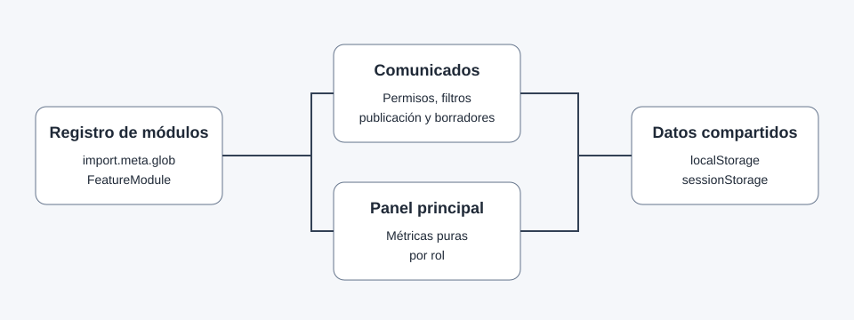

# Intranet escolar



## Presentación

Este repositorio corresponde a un prototipo académico de intranet escolar creado con
**React, TypeScript y Vite**. La solución separa autenticación, gestión de usuarios,
módulo académico, comunicados y panel principal para reducir conflictos entre ramas.

> Los datos del prototipo deben ser ficticios. No se deben utilizar datos reales de
> menores, credenciales reales ni secretos.

---

## Características

- Autenticación con los roles `ADMIN`, `TEACHER` y `STUDENT_FAMILY`.
- Gestión de usuarios desde el módulo base.
- Calificaciones y asistencia mediante el módulo académico.
- Comunicados con borradores, publicación, búsqueda y filtros.
- Panel principal con métricas específicas por rol.
- Restricción de datos académicos al estudiante relacionado.
- Persistencia del prototipo en `localStorage` y sesión en `sessionStorage`.
- Registro automático de módulos mediante `src/features/**/feature.tsx`.
- Pruebas con Vitest y React Testing Library según la configuración del proyecto base.

## Roles

| Rol | Capacidades principales |
| --- | --- |
| `ADMIN` | Gestiona usuarios y comunicados; consulta métricas administrativas. |
| `TEACHER` | Gestiona sus borradores, consulta comunicados pertinentes y métricas de sus cursos. |
| `STUDENT_FAMILY` | Consulta datos académicos del estudiante relacionado y comunicados autorizados. |

## Requisitos previos

1. Node.js y npm compatibles con la versión definida por el proyecto base.
2. Una copia del repositorio con `feature/foundation-auth-users` integrada en `main`.
3. Dependencias instaladas desde el `package-lock.json` del repositorio principal.
4. Navegador moderno con soporte para `crypto.randomUUID()`.

## Instalación

Desde un clon limpio del repositorio principal:

```bash
git switch main
git pull --ff-only
npm ci
git switch -c feature/communications-docs
```

Después, incorporar únicamente los archivos de esta entrega dentro de las rutas
permitidas y ejecutar las verificaciones del proyecto.

```bash
npm run lint
npm run test
npm run build
npm run lint:md
```

## Credenciales de demostración

Esta rama **no crea ni modifica credenciales** porque pertenecen a
`feature/foundation-auth-users`. Para evitar documentar valores inexistentes, las
credenciales ficticias deben copiarse desde los datos de demostración realmente
integrados en la base antes del pull request final.

| Perfil | Fuente de credenciales |
| --- | --- |
| Administración | Datos de demostración verificados en la base integrada. |
| Docente | Datos de demostración verificados en la base integrada. |
| Estudiante/Familia | Datos de demostración verificados en la base integrada. |

## Ejemplo de uso

1. Inicie sesión con un perfil ficticio disponible en la base.
2. Abra `/dashboard` y verifique que el resumen corresponda al rol activo.
3. Abra `/announcements`.
4. Como Administración, cree un borrador y publíquelo.
5. Como Docente, confirme que puede editar únicamente un borrador propio.
6. Como Estudiante/Familia, confirme que solo aparecen publicaciones para `ALL` o
   `STUDENT_FAMILY`.

## Estructura del alcance de esta rama

```text
src/features/
├── announcements/
│   ├── __tests__/
│   ├── components/
│   ├── data/
│   ├── pages/
│   ├── Announcements.module.css
│   ├── authorization.ts
│   ├── feature.tsx
│   └── validators.ts
└── dashboard/
    ├── __tests__/
    ├── data/
    ├── pages/
    ├── Dashboard.module.css
    ├── feature.tsx
    └── metrics.ts

docs/
├── assets/
│   └── module-overview.svg
├── modules/
│   └── communications.md
├── arquitectura.md
└── requerimientos.md
```

## Persistencia

Se respetan las claves obligatorias del contrato compartido. Los módulos de esta
rama consumen las siguientes:

- `schoolIntranet.v1.users`
- `schoolIntranet.v1.students`
- `schoolIntranet.v1.courses`
- `schoolIntranet.v1.enrollments`
- `schoolIntranet.v1.grades`
- `schoolIntranet.v1.attendance`
- `schoolIntranet.v1.announcements`
- `schoolIntranet.v1.session`

Los nuevos comunicados utilizan `crypto.randomUUID()` y fechas ISO 8601.

## Seguridad del prototipo

- No se incluyen datos reales de estudiantes.
- Los perfiles `STUDENT_FAMILY` filtran calificaciones y asistencia exclusivamente por
  `relatedStudentId`.
- Los borradores no se muestran a estudiantes o familias.
- Un Docente solo puede editar borradores cuyo `authorUserId` coincide con su sesión.
- Las acciones destructivas solicitan confirmación.
- Este almacenamiento del lado cliente es apropiado únicamente para un prototipo
  académico y no sustituye controles de autorización de un backend real.

## Pruebas

La rama incluye pruebas para:

- Visibilidad de comunicados por rol y audiencia.
- Exclusión de borradores para `STUDENT_FAMILY`.
- Bloqueo de edición de publicaciones ajenas para Docente.
- Conservación de `createdAt` y asignación de `publishedAt`.
- Métricas de Administración, Docente y Estudiante/Familia.
- Prevención de mezcla de datos entre estudiantes.
- Estado vacío del panel.

Los resultados finales de `npm run lint`, `npm run test`, `npm run build` y
`npm run lint:md` deben registrarse únicamente después de ejecutarlos en el repositorio
integrado, porque esta entrega aislada no incluye `package.json`.

## Colaboración

El flujo de trabajo completo está en [CONTRIBUTING.md](CONTRIBUTING.md). La rama de
este alcance es `feature/communications-docs` y no debe hacerse push directo ni force
push a `main`.

## Documentación relacionada

- [Arquitectura](docs/arquitectura.md)
- [Requerimientos](docs/requerimientos.md)
- [Comunicados](docs/modules/communications.md)
- [Memoria del agente](AGENTS.md)
- [Cambios](CHANGELOG.md)

## Licencia

Proyecto académico de uso educativo. Cualquier licencia definitiva debe coincidir con
la decisión del equipo y la institución antes de publicar el repositorio.
