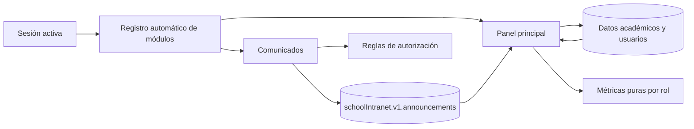

# Arquitectura de la intranet escolar


## Stack

La solución utiliza **React**, **TypeScript** y **Vite**. React Router gestiona las
rutas, CSS Modules encapsula estilos y Vitest con React Testing Library proporciona la
base de pruebas definida por el proyecto.

| Área | Tecnología o decisión |
| --- | --- |
| Interfaz | React y TypeScript |
| Empaquetado | Vite |
| Rutas | React Router |
| Estilos | CSS Modules y tokens globales existentes |
| Persistencia | `localStorage` |
| Sesión | `sessionStorage` |
| Pruebas | Vitest y React Testing Library |
| Integración | Git, ramas y pull requests |

## Estructura modular

Cada área vive dentro de `src/features`. Comunicados y panel no modifican el
enrutador central ni la navegación global.

```text
src/features/
├── announcements/
│   ├── components/
│   ├── data/
│   ├── pages/
│   └── feature.tsx
└── dashboard/
    ├── data/
    ├── pages/
    └── feature.tsx
```

## Registro automático de módulos

La base detecta `src/features/**/feature.tsx` mediante `import.meta.glob`. Cada módulo
expone:

- `id` único.
- `routes` con `path`, `component` y `allowedRoles`.
- `navigation` con la entrada visible según rol.

Esto evita que los integrantes editen un archivo central para registrar una ruta.

## Flujo de autenticación

1. El módulo base valida credenciales ficticias.
2. La sesión activa se persiste en `schoolIntranet.v1.session` dentro de
   `sessionStorage`.
3. Las rutas protegidas usan el rol de la sesión para permitir o denegar acceso.
4. Comunicados vuelve a validar permisos antes de una operación de escritura.
5. El panel busca el usuario activo y calcula métricas sobre datos compartidos.

## Autorización

La autorización se aplica tanto a la visibilidad como a las acciones:

- `ADMIN` puede consultar y administrar todos los comunicados.
- `TEACHER` consulta publicaciones para `ALL` o `TEACHER`, además de sus borradores.
- `TEACHER` solo edita borradores cuyo `authorUserId` coincide con la sesión.
- `STUDENT_FAMILY` solo consulta publicaciones `ALL` o `STUDENT_FAMILY`.
- El panel familiar filtra calificaciones y asistencia por `relatedStudentId`.

> La ocultación visual no sustituye la autorización. Por eso el repositorio de
> comunicados vuelve a comprobar permisos antes de modificar almacenamiento.

## Persistencia

Los módulos consumen únicamente claves definidas en el contrato compartido. No crean
copias alternativas de usuarios, estudiantes, cursos, calificaciones, asistencia ni
comunicados.

```text
schoolIntranet.v1.users
schoolIntranet.v1.students
schoolIntranet.v1.courses
schoolIntranet.v1.enrollments
schoolIntranet.v1.grades
schoolIntranet.v1.attendance
schoolIntranet.v1.announcements
schoolIntranet.v1.session
```

Los comunicados nuevos utilizan `crypto.randomUUID()` y fechas ISO 8601. Al editar se
preserva `createdAt`; al publicar se define `publishedAt` y se actualiza `updatedAt`.

## Flujo de datos



## Decisiones técnicas

- Las métricas del panel se calculan mediante funciones puras para facilitar pruebas.
- Los estudiantes matriculados de un Docente se cuentan de forma única entre sus
  cursos activos.
- La media académica familiar se calcula como porcentaje relativo
  `score / maxScore * 100` cuando `maxScore` es mayor que cero.
- El retiro de una publicación devuelve el comunicado a `DRAFT` y elimina
  `publishedAt`.
- Las acciones de eliminación y retiro utilizan confirmación explícita.
- Los estilos locales usan variables CSS con valores de respaldo y no redefinen
  estilos globales.

## Limitaciones

- `localStorage` y `sessionStorage` no ofrecen seguridad equivalente a un backend.
- Esta entrega aislada no contiene el `package.json` ni la implementación de
  `feature/foundation-auth-users`; por ello no se documentan resultados de scripts que
  no pudieron ejecutarse sobre el repositorio integrado.
- La firma concreta del servicio central de almacenamiento debe verificarse durante la
  integración con la base. Esta entrega usa las claves exactas del contrato y mantiene
  los accesos encapsulados en repositorios locales del módulo.
- Las métricas de calificaciones y asistencia dependen de que el módulo académico
  escriba los modelos compartidos acordados.

---

*La arquitectura prioriza separación de responsabilidades, integración sin conflictos
y protección de la información visible por rol.*
